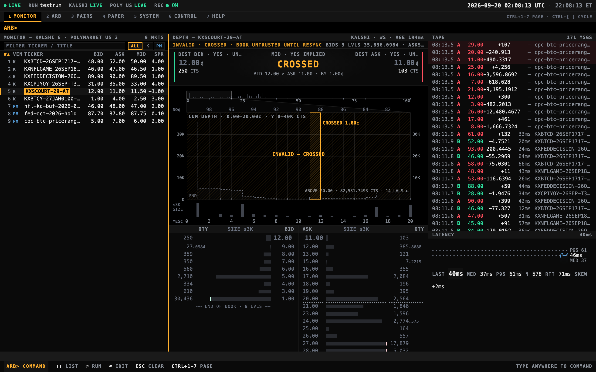
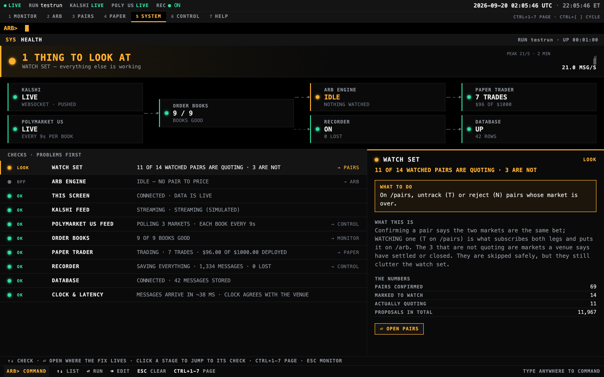
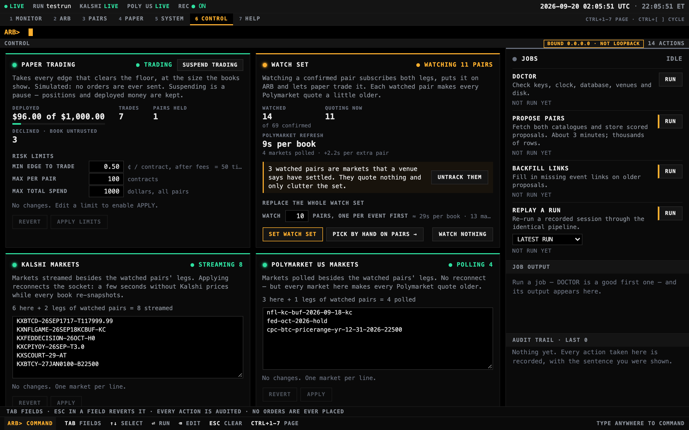

# Cross-Book — Kalshi × Polymarket US cross-venue arbitrage

Cross-Book (`arb` on the command line) measures price gaps between equivalent
binary markets listed on both **Kalshi** and **Polymarket US**
(docs.polymarket.us; the international Polymarket is out of scope).

The idea it is built around: the gap between two best prices is not an edge.
The edge is what is left after walking both order books level by level,
charging each venue's taker fee on every fill in exact integer arithmetic, and
stopping at the first fill that no longer pays for itself. The rest of the
system — one normalized book, a recorder that gets every message before the
parser does, replay through the same pipeline — exists so that number can be
trusted.


*MONITOR, the depth panel for one market. Every book in every screenshot here
is simulated by [`scripts/preview_ui.py`](scripts/preview_ui.py): no venue, key
or database was involved, the tickers are invented, and the `LIVE` badges
describe the UI's connection to that preview server, not live market data.*

## Status: read-only measurement and simulation

**No code that places, amends or cancels a real order exists in this
repository.** Everything built so far measures and simulates: venue adapters
(Kalshi over an authenticated WebSocket, Polymarket US over polled public
REST), a normalized order book, a raw-message recorder, a cross-venue pair
matcher, fee models, depth-aware edge measurement, a paper trader that
simulates fills against measured edges, and a control plane that drives all of
it from the browser. Trading real orders is a later milestone.

[`PROGRESS.md`](PROGRESS.md) has the current milestone and exactly what works
today. The build plan, hard rules and conventions that govern every change
live in [`CLAUDE.md`](CLAUDE.md); read it before adding code.

## What's interesting in here

- **The edge is walked, not read off the top of book.** `compute_direction()`
  in [`src/arb/edge.py`](src/arb/edge.py) merge-walks one venue's asks against
  the other's bids and stops at the first fill whose *marginal* gross no
  longer covers that fill's own taker fees on both legs. The rule is marginal,
  not average, so a wide first level cannot carry a losing tail. Fees in
  [`src/arb/fees.py`](src/arb/fees.py) are evaluated with `fractions.Fraction`
  and rounded the way each venue documents. Walkthrough:
  [`docs/engine.md`](docs/engine.md#edge-the-depth-aware-two-direction-walk).
- **One book model, in integers; venue quirks stop at the adapter.** Prices
  are integer ticks of $0.0001; quantities are integer units of 0.0001
  contracts, because live Kalshi books carry fractional counts
  ([`src/arb/types.py`](src/arb/types.py)). Kalshi publishes bids only, for YES
  and for NO; [`venues/kalshi/ws.py`](src/arb/venues/kalshi/ws.py) folds a NO
  bid at *x* into a YES ask at 10000 − *x* before shared code sees it. A
  [`Book`](src/arb/book.py) is valid only while it has a snapshot with no
  sequence gap since, is not crossed, holds only positive quantities at prices
  inside (0, 10000), and updated within the staleness limit. The paper trader
  declines any edge resting on a structurally invalid book.
- **Recorder first, then replay through the same code.** Every raw message is
  stamped (`recv_ts_ns`, `recv_mono_ns`, `run_id`, `ingest_seq`) and enqueued
  for [`src/arb/recorder.py`](src/arb/recorder.py) before it is parsed. The
  enqueue never blocks ingest: overflow is dropped and counted, and a failing
  sink is retried in place, never reordered.
  [`src/arb/replay.py`](src/arb/replay.py) reads a run back in `ingest_seq`
  order through the same adapters and `BookManager`, using the recorded
  monotonic clock.
- **The matcher proposes; a person decides.**
  [`src/arb/pairs/matcher.py`](src/arb/pairs/matcher.py) scores event pairs by
  IDF-weighted title similarity plus *outcome overlap*: how many of one event's
  outcomes have a name twin on the other venue. Rules text is deliberately not
  scored. It goes to the reviewer on `/pairs`, because that is where
  equivalence lives ([`docs/pairs.md`](docs/pairs.md)).
- **One executor for every control.** `ControlPlane.execute()` in
  [`src/arb/ui/control.py`](src/arb/ui/control.py) is the single path for every
  `/control` action: validate, state the effect as a sentence, refuse if
  read-only, arm or confirm, apply, audit. Confirmation is server-side, with a
  single-use 90-second token bound to a SHA-256 of `(action, params)`. Arming
  writes an audit row and fails closed: no row, no confirmable action.
- **Typing cannot write to the database.** Typing `RUN` on `/pairs` once fired
  `R`, `U` and `N` as hotkeys and wrote two rows to Postgres. The fix is a
  keyboard model whose three scopes are derived from `document.activeElement`
  on every keydown, not from a mode flag
  ([`docs/decisions.md`](docs/decisions.md#m19--the-keyboard-gets-a-focus-model-and-keys-get-a-price),
  [`core/keys.js`](src/arb/ui/static/js/core/keys.js)).
- **Tests built so they can fail.** Parser tests run against real captured
  payloads in [`tests/fixtures/`](tests/fixtures), never invented ones;
  `hypothesis` covers the book and the fixed-point types. The frontend has a
  unit suite on node's built-in runner (no `package.json`) and an acceptance
  suite driving the real frontend in headless Chrome over CDP. The frontend
  tests were mutation-tested, and two that could not fail were rewritten.
  There is no CI yet; [`docs/testing.md`](docs/testing.md) records that gap.

## Look at it without credentials

The preview serves the real FastAPI app and the real static frontend over
simulated books. It needs Python 3.12+, [uv](https://docs.astral.sh/uv/) and
nothing else: no `.env`, keys, Postgres or Docker, and it contacts no venue.

```sh
uv sync
uv run python scripts/preview_ui.py              # http://127.0.0.1:8765
uv run python scripts/preview_ui.py --failures   # same, plus a seq gap and a crossed book every 40 s
```

Kalshi books stream small deltas and Polymarket US books arrive as whole-book
polls, the way the real feeds do. The preview does not simulate tracked pairs,
so `/arb` shows its empty state.



*A crossed book, injected by `--failures` into a simulated Kalshi book. The
bid sits above the ask, so the book is marked invalid, greyed out and
untrusted until a resync.*

<p align="center">
  
  
</p>

*SYSTEM (left) and CONTROL (right), rendered against the preview's simulated
feeds. Their status values are constants the preview seeds, not measurements:
no database was running and no trades happened. The amber `BOUND 0.0.0.0`
badge is seeded to show the non-loopback warning; the preview itself listens
on `127.0.0.1`.*

## The terminal UI

`arb ui` serves a black/amber, keyboard-driven terminal at
`http://127.0.0.1:8080`, one URL per screen: `/` (markets, depth ladder, tape,
latency), `/arb` (cross-venue edge), `/pairs` (pair review), `/paper`
(simulated ledger), `/system` (diagnostics), `/control` (every runtime toggle
and job), `/help` (keys, commands, glossary) and `/market/<id>` (one market's
rules and live book). One process on one port serves them all, so every screen
deep-links, reloads and back-buttons like a normal web page; the same port
serves the Prometheus metrics behind the provisioned Grafana dashboard.

`CTRL+1`…`CTRL+7` jump between the nav pages on macOS (`ALT` elsewhere), a bare
letter typed anywhere goes to the `ARB>` command line, and a page's own
single-letter keys fire only once you have focused its row list with `↑`/`↓`.
More in [`docs/ui.md`](docs/ui.md) and [`docs/cli.md`](docs/cli.md#arb-ui).

## Getting started

```sh
cp .env.example .env          # fill in; .env is gitignored
uv sync                       # install dependencies (dev group included)
uv run pytest                 # add -m "not browser" to skip the headless-Chrome tests
node --test "tests/js/**/*.test.mjs"
uv run ruff check .
uv run pyright

docker compose up -d          # Postgres + pgvector, Prometheus, Grafana and the app container
uv run alembic upgrade head
uv run arb doctor
```

- `arb doctor` checks environment, keys, clock skew, database, venue
  reachability and disk; run it before the UI. It includes a
  millisecond-resolution SNTP check, because a lagging host clock makes every
  latency reading negative.
- `alembic upgrade head` is not optional: the control plane audits every
  action to the `control_actions` table, and the actions that write many rows
  refuse to run if that row cannot be written.
- The app container runs `arb ui` bound to `0.0.0.0` *inside* the compose
  network; the published port stays `127.0.0.1:8080`. A non-loopback bind is
  refused at startup unless `ARB_ALLOW_REMOTE_BIND=1` is set (compose sets it
  for that container): the UI has no authentication and its controls drive a
  trading process, so exposing it is an explicit opt-in. On the host you
  never meet this.

The terminal UI is the whole interface. It records while it runs, and
everything else is a control inside it. The app container already serves it on
`:8080`; to run it on the host instead, bring up only the infrastructure
(`docker compose up -d postgres prometheus grafana`) and start it yourself:

```sh
uv run arb ui --top 8 --pairs-top 10   # terminal UI at :8080 — start on /, then /help
```

Go to `/control` (`CTRL+6` on macOS, `ALT+6` elsewhere) to turn recording on
and off, suspend or resume paper trading and change its risk limits, change
either venue's market universe, reload the tracked pairs, or run a job
(doctor, pair proposal, slug backfill, replay). Nothing there needs a restart.
`arb ui --read-only` serves every screen and refuses every control-plane
action, for showing the terminal to someone ([limits](docs/ops.md#read-only-mode)).

There are only three CLI commands, and the other two exist for the cases a
button cannot cover: `arb doctor` runs when the UI *won't* start, and
`arb replay` is also the worker the REPLAY control spawns as a subprocess.
See [`docs/cli.md`](docs/cli.md) for every flag.

## Documentation

[`docs/README.md`](docs/README.md) is the full map. Highlights (all in `docs/`):

- [`architecture.md`](docs/architecture.md) — how the pieces fit together
- [`data-model.md`](docs/data-model.md) — `Ticks`/`Qty` fixed-point types, the
  `Book` model, storage schema
- [`venues/kalshi.md`](docs/venues/kalshi.md) and
  [`venues/polymarket-us.md`](docs/venues/polymarket-us.md) — per-venue details
- [`pairs.md`](docs/pairs.md) — the cross-venue pair matcher
- [`engine.md`](docs/engine.md) — fees, edge math, ARB monitor, paper, replay
- [`ui.md`](docs/ui.md) — the terminal UI: pages, backend, wire protocol
- [`cli.md`](docs/cli.md) — every `arb` subcommand, with examples
- [`ops.md`](docs/ops.md) — Compose stack, Prometheus/Grafana, deployment
- [`testing.md`](docs/testing.md) — test strategy and fixtures
- [`venue-notes.md`](docs/venue-notes.md) — verified API facts with doc
  citations (nothing here is guessed)
- [`decisions.md`](docs/decisions.md) — design choices and why

## Layout

```
src/arb/             shared package: types, Book, BookManager, interfaces, metrics,
                     config, recorder, CLI (ui/doctor/replay), fees, edge, arb
                     monitor, paper trader, replay engine
src/arb/venues/      venue-specific code only (kalshi/, polymarket_us/): auth,
                     discovery, REST/WS parsing, adapters
src/arb/pairs/       cross-venue pair matcher, storage, the propose and backfill
                     jobs the UI runs
src/arb/storage/     SQLAlchemy models + engine/session helpers
src/arb/ui/          FastAPI backend, the control plane (control.py), the
                     host/origin guard (security.py) and the static frontend it
                     serves (ES modules, one per page; no build step, no deps)
migrations/          Alembic migrations (Postgres schema)
infra/               Prometheus + Grafana provisioning
scripts/             dev tools: simulated-book preview, screenshotter, WS capture
tests/               pytest suite; tests/js/ is the node frontend suite
tests/fixtures/      real captured payloads for parser tests
docs/                architecture, venue notes, design decisions, img/
```

## Hard rules (summary)

The full list is in [`CLAUDE.md`](CLAUDE.md); the ones that matter most:

- No order placement, amend or cancel code until a later milestone explicitly
  calls for it. Everything today is read-only measurement and simulation.
- Prices are integer ticks of $0.0001; quantities are integer units of 0.0001
  contracts. No floats for prices, quantities or fees in book state or storage.
- Every venue fact is verified against the vendor's own documentation and
  cited in `docs/venue-notes.md`. Nothing is guessed.
- Secrets are never logged, printed or committed; `.env`, `secrets/` and key
  files are gitignored.
- Postgres, Prometheus and Grafana bind to `127.0.0.1` only.

## License

MIT — see [`LICENSE`](LICENSE).
